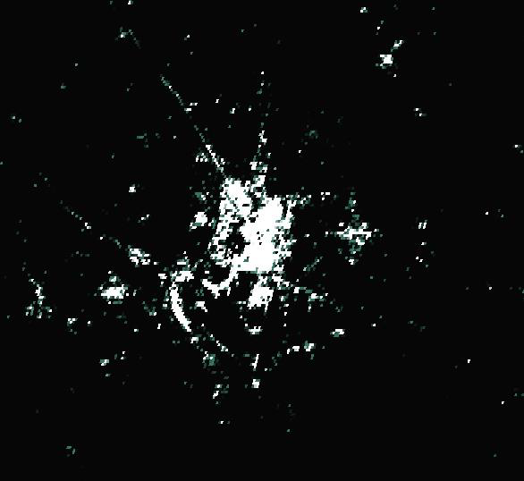

# A Study of Population Density Prediction Algorithms Using Satellite Imagery

## Summary

In this work we will discuss methods for constructing grided population maps from satellite imagery, such as RGB maps, Night light maps, Elevation maps, etc.. The main goals of this work is to improved existing methods for constructing grided population maps and to provide a list of important map features that are important in construction of such maps.

In the first chapter we will discuss existing solutions and methods we are going to use in our approach.

In second chapter we will provide a detailed description of our methods.

In the third part we will present the results of our research and compare how our approach in construction of grided population maps compares to others.

Finally we will give a short conclusion of everything discussed.

## Table of contents

* [List of figures](#list-of-figures)
* [List of tables](#list-of-tables)
* [List of abbreviations and terms](#list-of-abbreviations-and-terms)
* [Introduction](#introduction)
1. [Existing solutions](#1-existing-solutions)
1.1. [Purely statistical approach: GPWv4](#11-purely-statistical-approach-gpwv4)
1.2. [Incorporate satellite data: Global Human Settlement Layers](#12-incorporate-satellite-data-global-human-settlement-layers)
1.3. [Applying Random Forests: WorldPop](#13-applying-random-forests-worldpop)
1.4. [Comparison of GPWv4, GHSL and WorldPop](#14-comparison-of-gpwv4-ghsl-and-worldpop)
1.5. [Application of CNN for similar problems: Dynamic World](#15-application-of-cnn-for-similar-problems-dynamic-world)
2. [Methodology](#2-methodology)
2.1. [Data collection](#21-data-collection)
2.2. [Data pre-processing](#22-data-pre-processing)
2.3. [Models](#23-models)
2.3.1. [Random Forest](#231-random-forest)
2.3.2. [CNN](#232-cnn)
2.3.3. [Autoencoders](#233-autoencoders)
2.4. [Testing/Comparing](#24-testingcomparing)
3. [Implementation](#3-implementation)
3.1. [Demo App](#31-demo-app)
3.2. [Data collection](#32-data-collection)
3.2.1. [Random Forest](#321-random-forest)
* [List of references](#list-of-references)

## List of figures

FIXME (Write a script for extracting and updating this field)

## List of tables

FIXME (Write a script for extracting and updating this field)

## List of abbreviations and terms

Abbreviations:
* CNN – Convolutional neural network;
* ML – Machine learning;
* GPW – Gridded Population of the World;
* GHSL – Global Human Settlement Layers;
* SML – Symbolic Machine Learning;
* FCNN – Fully Convolutional Neural Network
* GEE – Google Earth Engine

Terms:
* Grided population map – a heat map of population with some fixed resolution in arcseconds.

## Introduction

Satellite Imagery, especially night-time light images [[1](#ref1)], have recently been used to determine various indicators at a regional or even smaller scale. This helps to collect missing information on less developed areas of the world, for which most indicators are simply not available or are very inaccurate. The aim of this work is to construct grided population map from satellite imagery, analyse best methods for such a task and to define a list of map features that are most important in construction of grided population maps.

The approaches suggested in this paper would be valuable in the following ways, when compared to similar works:
* It would tell how regular satellite data can describe population counts, without other inputs;
* It would allow to get population data at any time in any place, only limited by satellite availability;
* The use of CNN could reveal convolution kernels, that could extract interesting information from various maps.

In the following chapters we will discuss several existing solutions for constructing grided population maps, then we will discuss data sources used in this work, after that we will discuss several ML approaches for constructing grided population maps and finally we will explain how we will evaluate and compare our solutions.

## 1. Existing solutions

In this chapter we will discuss and compare three approaches for constructing grided population maps: The Gridded Population of the World (GPW), Global Human Settlement Layers (GHSL) and WorldPop. GHSL and WorldPop uses ML approaches while GPW uses purely statistical approach. Finally, we will discuss a CNN model for determining land use type by using satellite imagery called Dynamic World.

### 1.1. Purely statistical approach: GPWv4

The Gridded Population of the World version four (GPWv4) is a population heat map of the world ([see Figure 1](#fig1)) constructed by transforming census data to 30 arc-seconds (~1km) grid with the help of uniform distribution methods. It’s worth noting that this heat map does not include any satellite imagery or machine learning. [[2](#ref2)]

*Figure 1: GPWv4 Population Count layer map of Vilnius city [[3](#ref3)]*

The rough description how the GPWv4 was constructed is described as follows:
1. Collecting and aggregating census population data from various sources, such as national statistics offices, Unites Nations population estimates and many others. The collected population data varies in resolutions from country level to city data, as specific example would be data for Paris, the data for Paris where available at higher resolution then for the rest of the country; [[2](#ref2)]
2. Matching collected data to geographic boundaries. The geographic boundaries in most case were obtained from the same sources as census data. [[2](#ref2)]
3. Estimating data for target years (2000, 2005, 2010, 2015). To aggregate data form census data collected at different times, it had to be projected for given target year. [[2](#ref2)]
4. Transform estimated census data to raster view with resolution of 30 arc-seconds (~1km) grid. This was done by employing areal-weighting method (also known as uniform distribution, proportional allocation). This method didn’t used any other geographic data, than census data, geographic boundaries, water masks and united nations population estimates in the construction of population grid. [[2](#ref2)]

To determine quality of a specific area “mean administrative unit area data layer” can be used ([see Figure 2](#fig2)). This layer provides the average size of input unit at a specific location. [2]

*Figure 2: GPWv4 Mean Administrative Unit Area layer map of Vilnius city [[3](#ref3)]*

In this work GPWv4 will be used as ground truth data for training our model. GPWv4 was chosen because it is purely statistical approach and does not include any satellite imagery or machine learning.
The “mean administrative unit area data layer” will be employed in the selection of data for training.

### 1.2. Incorporate satellite data: Global Human Settlement Layers

Global Human Settlement Layers (GHSL) ([see Figure 3](#fig3)) combines GPWv4 and built-up presences data produced from Landsat imagery collections by European commissions Joint Research Centre (EC-JRC) to give better quality and resolution (250m), than GPWv4. [[4](#ref4)]

*Figure 3: GHSL Population Count map of Vilnius city [[3](#ref3)]*

The main idea behind GHSL is to map GPWv4 data to built-up presences map, and to get better resolution by doing so. Previously mentioned built-up presences data ([see Figure 4](#fig4)) was produced from Landsat imagery collection by employing method based on Symbolic Machine Learning (SML) [[5](#ref5)]. The method mainly consists of two steps: image data quantization sequencing and association rule analysis. This methodology was validated by using : a systematic field survey (EUROSTAT) and a set of digital cartographic products with building footprints. [[4](#ref4)]

*Figure 4: GHSL Built-up Presences map of Vilnius city [[3](#ref3)]*

One disadvantage of this methods, that our approach will try to solve is that GHSL depends on GPWv4, meaning that GHSL is only available when GPWv4 is available (for 2000, 2005, 2010, 2015), this problem could be partially solved by employing population estimates form United Nations.

### 1.3. Applying Random Forests: WorldPop

The WorldPop, like GPWv4 and GHSL, is a population heatmap ([see Figure 5](#fig5)). The main difference from GPWv4 and GHSL is that WorldPop has better resolution (100m) and employees ML methods in its approach, more specifically random forests. In the following paragraphs we will discuss the data that was used to train this model and the specifics of the model. [[6](#ref6)]

*Figure 5: WorldPop Population Count map of Vilnius city [[3](#ref3)]*

In its creation WorldPop used country specific census data (Cambodia, Vietnam, Kenya) at various administrative levels, land cover data from GeoCover and GlobCover with 13 classes that includes such classes as “Woody / Trees”, “Urban area”, “Water bodies”, “Industrial area”, “Rural settlement” among many others, satellite data such as night light data (Suomi VIIRS), mean temperature (WorldClim/BioClim), elevation (HydroSHEDS) and derived data like distance to roads, distance to rivers/streams. WorldPop did not used RGB imagery. [[6](#ref6)]

The datasets mentioned previously where aggregated to have uniform resolution and used in Random Forests model that tried to predict population density based on pixel bands values (single pixel includes all of the datasets mentioned above). Then from this density map, population map can be produced by redistribution density to population counts by taking country level population data. [[6](#ref6)]

Finally, the solution was compared with GPW, GRUMP, and Afri/AsiaPop methodologies. [[6](#ref6)]

It’s also worth noting most important variables of random forest model, they are as follow in decreasing order: “Generic health facilities”, “Lights at night”, “Settlement points”, “Communities”, “urban/rural” and “Schools”. Other variables where less important. [[6](#ref6)]

While creating a model in this work the most important variables and testing/comparing
methodologies discussed at WorldPop [[6](#ref6)] will be taken into account.

### 1.4. Comparison of GPWv4, GHSL and WorldPop

After reviewing GPWv4, GHSL, WorldPop we can see the advantages and disadvantages, that different methods have. GPWv4 is purely statistical approach and thus can be used in many different applications, the main issue with GPWv4 is its low resolution of 1km, if we would look at [Figure 1](#fig1) we can see that it is even worse than 1km, the resolution of GPWv4 depends on administrative area for which census data was collected. The GHSL has resolution of 250m and uses ML approach for identifying populated areas and then mapping GPW on those areas. The main problem with GHSL is it's dependency on GPW. The WorldPop has the highest resolution of 100m from discussed approaches, but if we would compare GHSL ([see Figure 3](#fig3)) and WorldPop ([see Figure 5](#fig5)) we would see that WorldPop map is much more blurry and has hard edges. The general comparison of all three methods in resolution and data used can be seen in [Table 1](#tbl1).

|                                       | GPWv4                                                                | GHSL                                                                    | WorldPop                       |
|---------------------------------------|----------------------------------------------------------------------|-------------------------------------------------------------------------|--------------------------------|
| Resolution                            | 1000m                                                                | 250m                                                                    | 100m                           |
| Uses census data                      | Yes (Only census)                                                    | Yes                                                                     | Yes                            |
| Uses derived data sets (e.g Land use) | No (Only uses country borders, administrative units and water masks) | Yes (GPW)                                                               | Yes (Many different data sets) |
| Uses steatite data directly           | No                                                                   | Partially (uses built-up presences, this data set was created for GHSL) | Yes (Uses night light data)    |

*Table 1: The comparison of GPWv4, GHSL and WorldPop in the aspects of resolution, census data used, derived data sets used and directly used satellite data*

### 1.5. Application of CNN for similar problems: Dynamic World

Dynamic Word isn’t a girded population map, but it’s still useful to analyse it because it uses CNN to determine land uses from satellite imagery ([see Figure 6](#fig6)).

*Figure 6: Dynamic World land use type map of area near Warsaw. In read – city areas (Warsaw), in blue – water and rivers, in dark green – forested areas, in light green – wild fields, in orange – worked fields. [[3](#ref3)]*

Dynamic World used data from Sentinel-2 images, this data was annotated by hand for model training. The training data included about 25000 images that were taken from variety of locations. [[7](#ref7)]

This data was used to train Fully Convolutional Neural Network (FCNN) [[8](#ref8)]. FCNN transform sentinel-2 optical bands to probability distribution of land uses classes which are later used to determine land use type. [[7](#ref7)]

From dynamic world we can see that CNNs can be a useful tool when trying to extract socioeconomic data like land use or population density/count from satellite imagery like Sentinel.

## 2. Methodology

This chapter discusses the techniques and models used in construction of gridded population maps from satellite imagery. The data used in this work is accessed from Google Earth Engine and preprocessed with normalization and standardization. The models used include Random Forest, CNNs, and Autoencoders, each with their own specific approach. In the end of this chapter we also describe the methodology for testing and comparing previously mentioned ML models.

### 2.1. Data collection

All of the data that will be used in this paper can be accessed via google earth engine (GEE) [3]. In [Table 2](#tbl2) a list of datasets from GEE is provided. Examples from each data set can be seen in [Figure 7](#fig7).

|    Source    | What is included | Resolution |
|:------------:|:----------------:|:----------:|
| GPWv4        | Population Count | 927m       |
| DMSP OLS     | Nighttime Lights | 927m       |
| VIIRS        | Nighttime Lights | 463m       |
| USGS Landsat | RGB + NIR        | 30m        |
| Sentinel-2   | RGB + NIR        | 10m        |
| Sentinel-2   | Aerosols         | 60m        |
| Sentinel-5P  | Carbon Monoxide  | 1113m      |

*Table 2: A list of several GEE data sets, for comparison and training*

*Figure 7: Satellite imagery of Vilnius city taken from various sources, the sources from left to right are GPWv4 (Population Count), DMSP OLS (Nighttime Lights), VIIRS (Nighttime Lights), USGS Landsat (RGB), Sentinel-2 (RGB), Sentinel-2 (Aerosols), Sentinel-5P (Carbon Monoxide) [[3](#ref3)]*

### 2.2. Data pre-processing

After getting our data we still need to pre-process it, because the data (even taken from the same source) can differ in quality over time, because of factors like temperature, humidity, weather, etc..
The pre-processing includes: normalizing resolution where it differs in time, normalize contrast using 2–98% percentile interval, standardise the data set so that it would have mean value of 0 and standard distribution value of 1. [[9](#ref9)]

### 2.3. Models

In the following sections we will discuss three approaches for constructing gridded population maps from satellite imagery: Random Forest, CNNs and Autoencoders. Random Forest will use surrounding pixels to get more accurate results, CNN will use multi-scale images to increase accuracy and Autoencoders will be used to extract population related features.

#### 2.3.1. Random Forest

As we already saw in WorldPop [[6](#ref6)], random forests can be a useful tool when constructing grided population map from various sources. In this paper we will also try to apply random forest algorithm, when constructing population heatmap.

In our random forest approach, we are going to include, not only the data from the single pixel we are trying to predict, but also its surrounding environment ([see Figure 8](#fig8)), we are basing this decision on a simple fact, that a pixel representing an apartment complex in a large city and small town can look identically, while their inhabitant count differs drastically, but if we would add the surrounding areas of the pixel, the separation of pixels in question would become much more simpler.

*Figure 8: Random forest data selection methodology, where surrounding areas are also included, not only the pixels we are trying to predict.*

To find optimal number and methodology of neighbouring pixel inclusion, multiple random forest models will be trained with, different number of neighbouring pixels and different sampling distances from centre pixel. Then variable importance graphs will be analysed for each model to determine optimal methodology of neighbouring pixel inclusion. Several neighbouring pixel methods are displayed at [Table 3](#tbl3).

|              Method             |  Number of points  |        Distance from centre        |
|:-------------------------------:|:------------------:|:----------------------------------:|
| No neighbours                   | 0                  | 0                                  |
| Linear distance neighbours      | 4, 8, 16           | 1km, 2km, 3km                      |
| Exponential distance neighbours | 4, 8, 16           | 1km, 10km, 100km                   |
| Mixed distance neighbours       | 4, 4, 8, 8, 16, 16 | 1km, 2km, 10km, 20km, 100km, 200km |

*Table 3: A list of different methods for neighbouring pixel inclusion, this list consists of linear, exponential and mixed methods*

#### 2.3.2. CNN

From GHSL [[4](#ref4)] and Dynamic World [[7](#ref7)] we observed that CNNs are a powerful tool when analysing satellite imagery. The benefits of CNNs compared to random forests are that CNNs can take an entire image not just a few select pixels, but this comes with a cost – the larger the image the more computation power we will need. This becomes a problem when we try to include neighbouring areas into account when predicting population. For example if we would try to predict population for area with resolution of 100𝑚 and include 100𝑘𝑚 of neighbouring areas our input size would grow from 100 (0.01𝑚2) pixels to 1020100 (0.01𝑚2) (by a factor of 10201). The solution for this problem would be to make multi scale image (see [Figure 9](#fig9)). But this could cause additional problems for CNN models, the possibility of using CNNs on multi scale images will be investigated in this paper.

*Figure 9: On the left is a regular image of several houses in the centre and their surrounding environment, on the right is the same image but scaled in such a way that majority of information is contained at the centre of the image, the areas at edges are compere [[3](#ref3)]*

#### 2.3.3. Autoencoders

Autoencoders [[10](#ref10)] had recently been used in various applications from molecular design [[11](#ref11)] to feature extraction [[10](#ref10)]. In this paper a modified version of autoencoders will be used for constructing grided population maps and extracting features related to population from various satellite imagery.
The modification will consist of changing the target (output) of the encoder from source image to multiple images of grided population maps ([see Figure 10](#fig10)), when calculating loss function the errors for each output image will be summed. This approach should extract features from satellite imager that are highly related to population. The use of multiple outputs should help to reduce the bias of our model, because different grided population maps have different methodology and our goal is to construct such a map, not to relearn the methodology.

*Figure 10: Proposed modification to autoencoder architecture. The main idea of this modification is to train autoencoder to extract population related features by changing the output layer of autoencoder to multiple population maps.*

### 2.4. Testing/Comparing

To determine the quality of our approach usual metrics like Mean squared error will be used. For comparison with other methods (GPW5, GHSL and WorldPop) we will employ the population density map of Vilnius city [[12](#ref12)] ([see Figure 11](#fig11)). For comparison we will simply calculate the MSE for each approach in relation with population density map of Vilnius city. Because Vilnius city will be used for our final evaluation and comparison it will not be used in training of the model.

*Figure 11: Population density of Vilnius city per 1 hectare based on declared place of residence [[12](#ref12)]*

## 3. Implementation

In this chapter we will show/discuss the implementation of methodology discussed above. At first, we will describe a demo app that will be used to illustrate our models, after that we will expand on previously defined methodology with their implementations.

### 3.1. Demo App

To illustrate the findings of this paper the application for sowing population heatmaps will be developed. The functional requirements of this application are described in the following list:
1. The application must have multiple map views (2x2 grid), 2 views for displaying selected feature maps, 2 views for displaying selected model results ([See Figure 12](#fig12)).
2. The application must show information about selected model, its accuracy, its architecture, and other relevant information. ([See Figure 13](#fig13)).
3. The application must include a page where the entire methodology is explained ([See Figure 14](#fig14)).
4. The application must allow to select location, select model to explore, select model to compare, select features to compare, select ground truth data used when calculating accuracy and select accuracy metric to show (See menu in [Figure 12](#fig12)).
5. The application must be developed using JavaScript and python.

*Figure 12: The Compare maps window of application*

*Figure 13: The Explore models window of application*

*Figure 14: The Methodology window of application*

### 3.2. Data collection

All the data, except for Vilnius related data, where collected via GEE. The following features from GEE were used in our model: different wave lengths form Copernicus satellite, ESA world cover layer and VIIRIS night light layer. For labels GHSL from GEE and Vilnius map from “gis Vplanas” was used. After defining these layers we extracted their values for a specific area and save these values to numpy array for further usage. The exact pipeline can be seen in [Figure 15](#fig15).

*Figure 15: Sequence diagram for data collection*

#### 3.2.1. Random Forest

We tried number of experiments on random forest with different surrounding point sampling and different data splits.
When we splinted our data set randomly (selected pixels at random), we couldn’t test it properly, because our testing set values where close to our training set, but this model still helped us to determine what variables have the most impact ([See Figure 16](#fig16)).

*Figure 16: Result of random forest with “random” train/test split*

After encountering the problem described above, we decided to split our data in “half” ([see Figure 17](#fig17))

*Figure 17: "Half" data spilt.*

After this split we got more accurate results, from these results we can see that night light data is one of primary indicators determining the population density ([See Figure 18](#fig18)).

*Figure 18: Results of random forest with “half” train test split*

## List of references

1. Measuring Economic Growth from Outer Space. J. Vernon Henderson, Adam Storeygard, David N. Weil. 2012, The American Economic Review.
2. Documentation for the Gridded Population of the World, Version 4 (GPWv4). NASA Socioeconomic Data and Applications Center (SEDAC). 2018.
3. Google Earth Engine: Planetary-scale geospatial analysis for everyone. Gorelick, Noel and Hancher, Matt and Dixon, Mike and Ilyushchenko, Simon and Thau, David and Moore, Rebecca. 2017.
4. Development of new open and free multi-temporal global population grids at 250 m resolution. Sergio Freire, Kytt MacManus, Martino Pesaresi, Erin Doxsey-Whitfield, Jane Mills. 2016.
5. Benchmarking of the Symbolic Machine Learning classifier with state of the art image classification methods. Martino Pesaresi, Vasileios Syrris, Andreea Julea. 2015.
6. Disaggregating Census Data for Population Mapping Using Random Forests with RemotelySensed and Ancillary Data. Forrest R. Stevens, Andrea E. Gaughan, Catherine Linard, Andrew J. Tatem. 2015.
7. Dynamic World, Near real-time global 10 m land use land cover mapping. Brown, C.F., Brumby, S.P., Guzder-Williams, B. et al. 2022.
8. Fully Convolutional Networks for Semantic Segmentation. Jonathan Long, Evan Shelhamer, Trevor Darrell. 2015.
9. Urban Change Detection from Aerial Images Using Convolutional Neural Networks and Transfer Learning. Tautvydas Fyleris, Andrius Kriščiūnas, Valentas Gružauskas, Dalia Calnerytė and Rimantas Barauskas. 2022.
10. Autoencoders. Dor Bank, Noam Koenigstein, Raja Giryes. 2020.
11. Application of Generative Autoencoder in De Novo Molecular Design. Thomas Blaschke, Marcus Olivecrona, Dr. Ola Engkvist, Prof. Jürgen Bajorath, Dr. Hongming Chen. 2017.
12. Planavimas ir statyba. VMS interaktyvūs žemėlapia. [Online] 2023. [Cited: 14 01 2023.] https://maps.vilnius.lt/teritoriju-planavimas#layers.